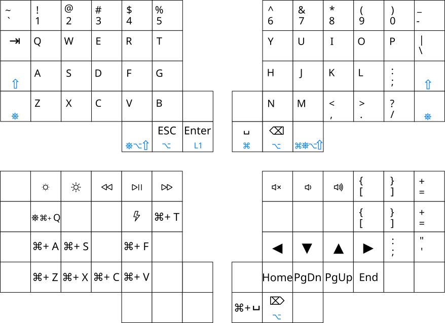

# QMK Userspace

This is a [QMK Userspace](https://github.com/qmk/qmk_userspace) for custom keyboards layouts.
It's a split layout as seen in the picture.



It's meant to be used [together](us_cat_ergo_all.png) with the [`us_cat`](https://github.com/schildwaechter/us_cat) layout.

## Use

Install qmk

```shell
brew install qmk/qmk/qmk
```

Clone this repo and the `qmk_firmware` repo.
Remember to set up

```shell
qmk config user.qmk_home="$(realpath qmk_firmware)"
qmk config user.overlay_dir="$(realpath qmk_userspace)"
```

## Compile

Use this with [Avalance v4](https://github.com/vlkv/avalanche).

```shell
make avalanche/v4:schildwaechter
make avalanche/v4:schildwaechter:flash
```

or go for the [Keebio Iris LM](https://keeb.io/products/iris-lm-keyboard) with

```shell
make keebio/iris_lm/k1:schildwaechter
make keebio/iris_lm/k1:schildwaechter:flash
```
